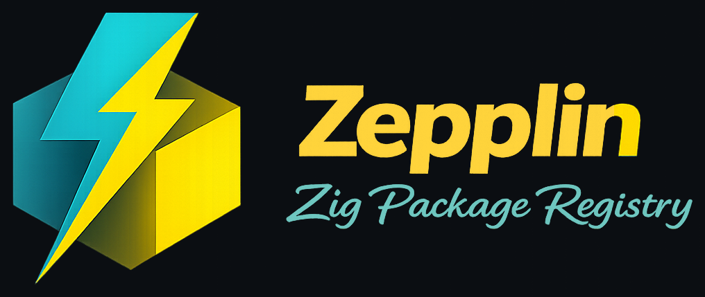
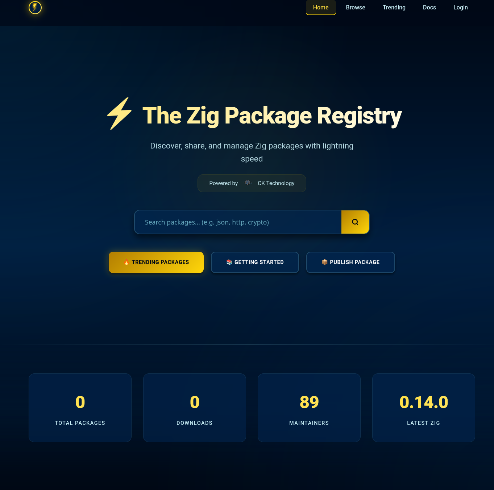

<p align="center">
  
</p>

# ⚡ Zepplin

> A lightweight, blazing-fast package manager and self-hosted registry for the Zig ecosystem.

Zepplin is your minimal, high-performance companion for managing Zig projects and packages. Designed to bring the convenience of `cargo` and the scalability of Kellnr to Zig, Zepplin helps developers stay focused on performance and simplicity — just like Zig itself.

**🎉 WORKING PROTOTYPE - ALL THREE COMPONENTS IMPLEMENTED!**
- ✅ CLI Package Manager
- ✅ Self-Hosted Registry Server  
- ✅ Beautiful Web Interface
- ✅ Docker Support



---

## 🚀 Quick Start

```bash
# Clone and build
git clone <your-repo-url>
cd zepplin
./dev.sh build

# Start the registry server
./dev.sh serve

# In another terminal, use the CLI
./dev.sh run init                    # Initialize a new project
./dev.sh run add xev                 # Add a package
./dev.sh run publish                 # Publish to registry
```

---

## 🔧 CLI Commands

```bash
zepplin init               # Bootstrap a new Zig project with zepplin.toml
zepplin add xev            # Add a package from the registry
zepplin add xev@1.2.0      # Add a specific version
zepplin update             # Update all dependencies
zepplin build              # Run zig build + dependency resolution
zepplin publish            # Package and push to the registry
zepplin login [registry]   # Authenticate with your registry
zepplin serve [port]       # Start the registry server (default: 8080)
zepplin browse             # Browse packages by category
zepplin trending           # Show trending packages
```

---

## 🌐 Self-Hosted Registry

Zepplin includes a built-in registry server with a beautiful web interface:

### Features
- **🎨 Modern Web UI** - Browse packages with a sleek, dark-themed interface
- **🔍 Real-time Search** - Find packages instantly
- **📊 Usage Statistics** - Track downloads and package metrics
- **🔐 Authentication** - Secure package publishing
- **🚀 RESTful API** - Full API for programmatic access
- **📦 Package Management** - Upload, version, and manage packages

### Web Interface
Visit `http://localhost:8080` after starting the server to access the web interface with:
- Package browser and search
- Download statistics
- Package details and documentation
- User management (coming soon)

### API Endpoints
```
GET  /                           # Web interface
GET  /api/packages               # List all packages
GET  /api/packages/{name}        # Get package details
POST /api/packages               # Publish a package (requires auth)
GET  /api/search?q={query}       # Search packages
```

---

## � Docker Deployment

### Quick Docker Run
```bash
# Build and run with Docker
./dev.sh docker-build
./dev.sh docker-run 8080

# Or manually
docker build -t zepplin .
docker run -p 8080:8080 -v zepplin-data:/data zepplin
```

### Production with Docker Compose
```bash
# Start the full stack (registry + nginx)
docker-compose --profile production up -d

# Development mode (registry only)
docker-compose up -d
```

The Docker setup includes:
- **Multi-stage builds** for minimal image size
- **Health checks** for reliability
- **Volume persistence** for package data
- **Nginx reverse proxy** with rate limiting and caching
- **Non-root user** for security

---

## 🏗️ Project Architecture

```
src/
├── main.zig           # Entry point (CLI + server mode)
├── root.zig           # Library exports
├── cli/               # Command-line interface
│   ├── cli.zig        # CLI command implementations
│   └── commands.zig   # Command parsing and help
├── server/            # Registry server
│   └── server.zig     # HTTP server and web UI
└── common/            # Shared types and utilities
    └── types.zig      # Package metadata, API types
```

### Configuration Files
- `zepplin.toml` - Project configuration and dependencies
- `zepplin.lock` - Locked dependency versions (like Cargo.lock)
- `docker-compose.yml` - Container orchestration
- `nginx.conf` - Reverse proxy configuration

---

## 📋 Development

### Prerequisites
- Zig 0.16.0 or later
- Docker (optional, for containerized deployment)

### Development Workflow
```bash
# Build and test
./dev.sh build
./dev.sh test

# Run CLI commands
./dev.sh run help
./dev.sh run init

# Start development server
./dev.sh serve 3000

# Clean build artifacts
./dev.sh clean
```

### Development Script Commands
| Command | Description |
|---------|-------------|
| `build` | Build the project |
| `test` | Run all tests |
| `run [args...]` | Execute CLI with arguments |
| `serve [port]` | Start registry server |
| `docker-build` | Build Docker image |
| `docker-run [port]` | Run in Docker |
| `dev-up` | Start development environment |
| `dev-down` | Stop development environment |
| `clean` | Clean build artifacts |

---

## �️ Roadmap

### Phase 1: Core Functionality ✅
- [x] CLI command structure
- [x] Basic package management commands
- [x] HTTP registry server
- [x] Web interface
- [x] Docker deployment

### Phase 2: Package Management 🚧
- [ ] TOML configuration parsing
- [ ] Dependency resolution
- [ ] Package downloading and caching
- [ ] Integration with `zig build`
- [ ] Package validation and signing

### Phase 3: Registry Features 📋
- [ ] User authentication and authorization
- [ ] Package publishing workflow
- [ ] Search and discovery
- [ ] Usage analytics
- [ ] Package documentation hosting

### Phase 4: Advanced Features 🔮
- [ ] Binary caching
- [ ] Multi-registry support
- [ ] Package mirroring
- [ ] CI/CD integration
- [ ] Package vulnerability scanning

---

## 🔐 Security

- **Package Signing** - GPG/cryptographic verification
- **Rate Limiting** - Prevent abuse via nginx
- **Input Validation** - Strict parsing and validation
- **Container Security** - Non-root user, minimal attack surface
- **HTTPS Support** - TLS encryption for production

---

## 🤝 Contributing

1. Fork the repository
2. Create a feature branch
3. Make your changes
4. Run tests: `./dev.sh test`
5. Submit a pull request

---

## 📜 License

MIT

---

## 📚 Documentation

- **[Deployment Guide](docs/deployment/DEPLOYMENT_GUIDE.md)** - Complete production deployment with nginx
- **[Deployment Quickstart](docs/deployment/DEPLOYMENT_QUICKSTART.md)** - Quick deployment steps
- **[SQLite Integration](docs/api/SQLITE_INTEGRATION.md)** - Database implementation details
- **[Zigistry Integration](docs/api/ZIGISTRY_INTEGRATION.md)** - Package discovery features
- **[GitHub OAuth Setup](docs/sso/GITHUB_OAUTH_SETUP.md)** - GitHub SSO configuration
- **[OIDC Setup](docs/sso/OIDC_SETUP_DOC.md)** - OpenID Connect configuration

---

> Made with Zig ⚡ | Inspired by Cargo & Kellnr 🚀 | Built for hackers 🛠️

**Zepplin** brings the best of Rust's Cargo and private registry hosting to the Zig ecosystem, providing developers with a complete solution for package management and distribution.

**🎉 Production Ready**: Complete SQLite backend, Zigistry integration, Docker deployment, and nginx configuration included!

