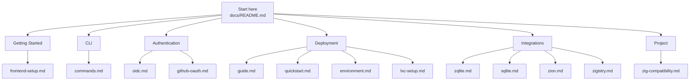
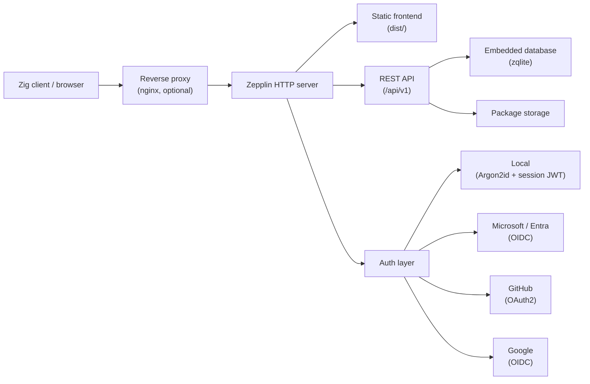
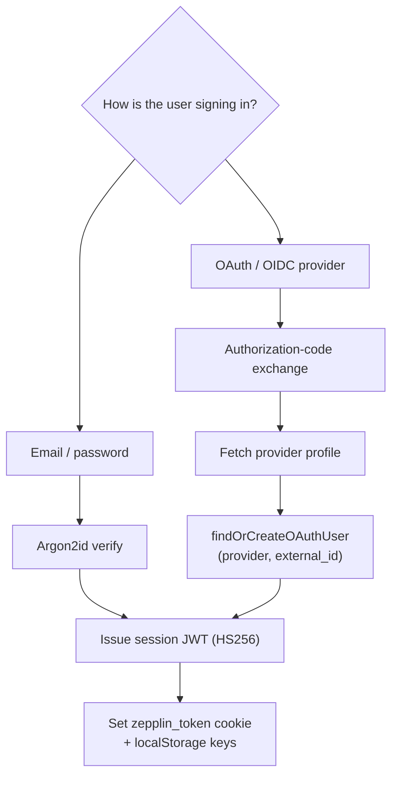

# Zepplin Documentation

Zepplin is a self-hostable package registry for Zig, backed by an embedded
database and a static frontend served by a Zig HTTP server. The documentation is
organized around getting the registry running, configuring authentication,
deploying to production, and integrating client tooling.

## Documentation Map

## Runtime Shape

## Authentication Flow

## Getting Started

- [Frontend Setup](getting-started/frontend-setup.md) - Build and run the Astro frontend that the server serves from `dist/`.

## CLI

- [Commands Reference](cli/commands.md) - Full command and flag reference for the Zepplin command-line tool.

## Authentication

- [OIDC / OAuth Setup](authentication/oidc.md) - Configure Microsoft/Entra OIDC and GitHub OAuth providers.
- [GitHub OAuth Setup](authentication/github-oauth.md) - Step-by-step GitHub OAuth app configuration.

## Deployment

- [Deployment Guide](deployment/guide.md) - Production deployment behind an external nginx reverse proxy.
- [Deployment Quickstart](deployment/quickstart.md) - Condensed checklist for a production deploy with OAuth.
- [Environment Configuration](deployment/environment.md) - Environment variables for configuring the server at runtime.
- [Proxmox LXC Setup](deployment/lxc-setup.md) - Provision and configure a Proxmox LXC container for the registry.

## Integrations

- [ZQLite Database](integrations/zqlite.md) - Using ZQLite as the embedded database engine.
- [SQLite Backend](integrations/sqlite.md) - SQLite-backed persistent storage details.
- [Zion Client](integrations/zion.md) - Integrating the Zion package manager with a Zepplin registry.
- [Zigistry](integrations/zigistry.md) - Zigistry interoperability and indexing notes.

## Project

- [Zig Compatibility](project/zig-compatibility.md) - Compatibility notes and breaking-change guidance across Zig versions.

## Quick Links

| Area | Path |
|------|------|
| Project README | [`../README.md`](../README.md) |
| Release notes | [`../CHANGELOG.md`](../CHANGELOG.md) |
| Build script | [`../build.zig`](../build.zig) |
| Package metadata | [`../build.zig.zon`](../build.zig.zon) |
| Server source | [`../src/server/server.zig`](../src/server/server.zig) |
| Auth modules | [`../src/auth/`](../src/auth/) |
